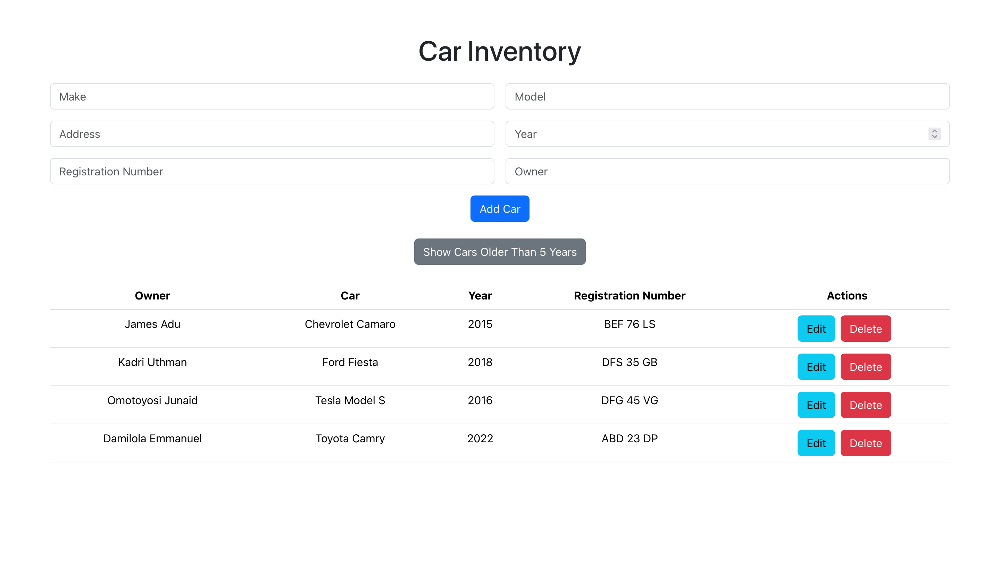

# Car Inventory Management System

A MERN stack application to manage car inventory, including functionalities to add, update, delete, and list cars. The application also supports listing cars older than 5 years.



## Table of Contents

- [Car Inventory Management System](#car-inventory-management-system)
  - [Table of Contents](#table-of-contents)
  - [Features](#features)
  - [Technologies Used](#technologies-used)
  - [Prerequisites](#prerequisites)
  - [Installation](#installation)
  - [Usage](#usage)
  - [API Endpoints](#api-endpoints)
  - [Contributing](#contributing)
  - [License](#license)

## Features

- Add new cars to the inventory
- Update existing car details
- Delete cars from the inventory
- List all cars
- List cars older than 5 years
- Handle validation errors and provide user feedback

## Technologies Used

- MongoDB
- Express.js
- React
- Node.js
- Axios

## Prerequisites

Make sure you have the following installed on your system:

- [Node.js](https://nodejs.org/)
- [MongoDB](https://www.mongodb.com/)

## Installation

1.  Clone the repository:

    ```sh
    git clone https://github.com/Damilordz/car_inventory.git
    cd car-inventory-management
    ```

2.  Install server dependencies:

    ```sh
    cd server
    npm install
    ```

3.  Install frontend dependencies:

    ```sh
    cd ../frontend
    npm install
    ```

4.  Set up environment variables:

    Create a `.env` file in the `backend` directory and add the following:

    ```env
    PORT=8000
    MONGO_USER=yourMongoDBUsername
    MONGO_PASSWORD=yourMongoDBPassword
    MONGO_DB_NAME=yourDatabaseName
    ```

    Replace `yourMongoDBUsername`, `yourMongoDBPassword`, and `yourDatabaseName` with your actual MongoDB credentials.

5.  Start the server:

    ```sh
    cd backend
    npm start
    ```

6.  Start the frontend:

    ```sh
    cd ../frontend
    npm start
    ```

## Usage

1. Open your browser and go to `http://localhost:3000` to access the Car Inventory Management System.
2. Use the form to add new cars to the inventory.
3. Edit or delete existing cars using the action buttons in the car list.
4. Use the "Show Cars Older Than 5 Years" button to filter cars based on their age.

## API Endpoints

- `POST /cars` - Add a new car
- `PUT /cars/:id` - Update a car by ID
- `DELETE /cars/:id` - Delete a car by ID
- `GET /cars` - List all cars
- `GET /cars/old` - List cars older than 5 years

## Contributing

Contributions are welcome! Please follow these steps:

1. Fork the repository.
2. Create a new branch (`git checkout -b feature-branch`).
3. Make your changes.
4. Commit your changes (`git commit -m 'Add new feature'`).
5. Push to the branch (`git push origin feature-branch`).
6. Open a Pull Request.
